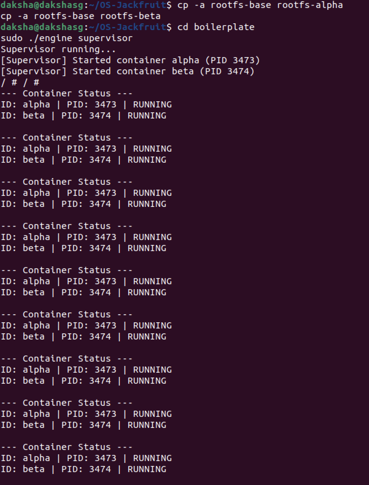
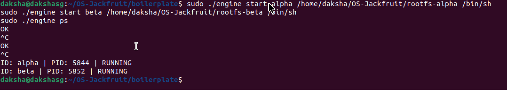
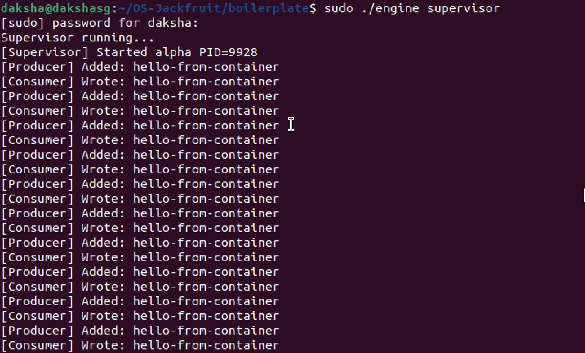
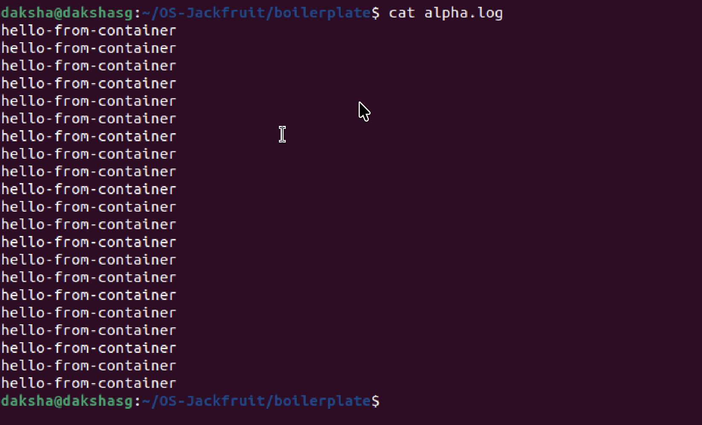
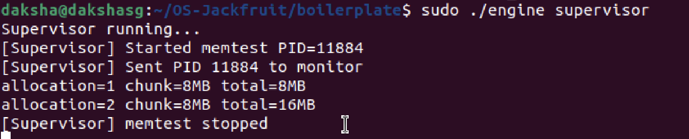
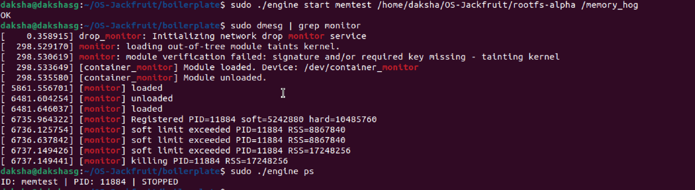
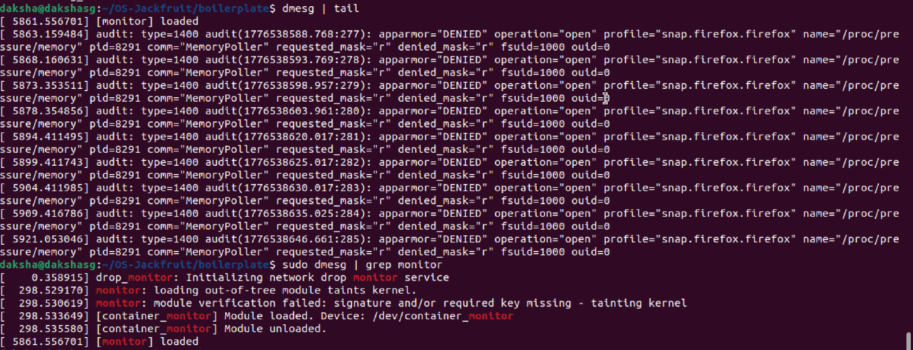
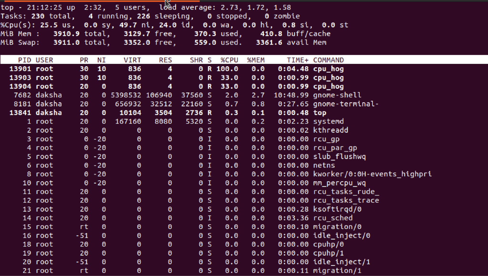
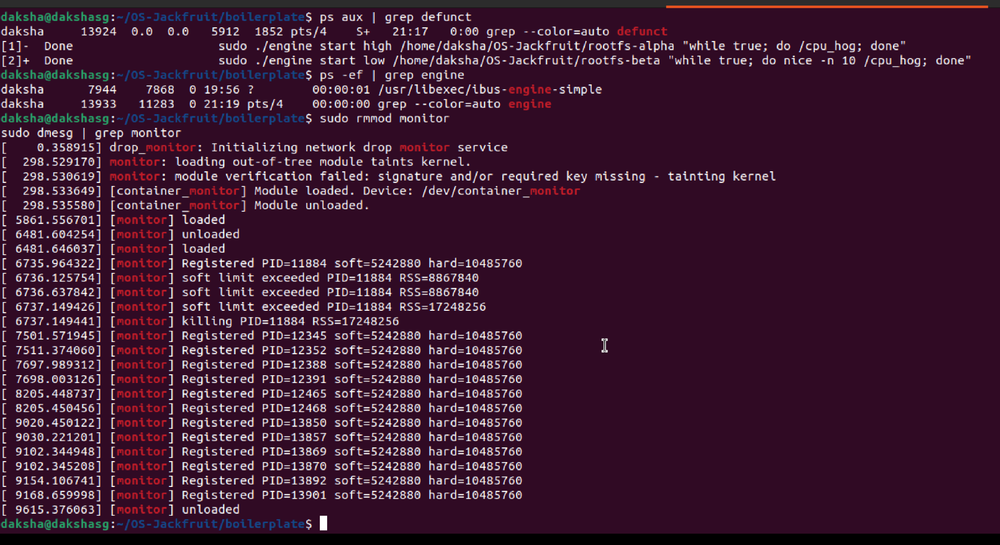

# OS-Jackfruit: Multi-Container Runtime

A lightweight Linux container runtime in C featuring a long-running parent supervisor, kernel-space memory monitoring, bounded-buffer logging, and scheduling experiments.

---

## 1. Team Information

| Name | SRN |
|------|-----|
| DAKSHA SG | PES1UG24CS137 |
| NAVYA SURESH | PES1UG24CS904 |

---

## 2. Build, Load, and Run Instructions

### Prerequisites

Ubuntu 22.04 or 24.04 VM with Secure Boot OFF. WSL will not work.

```bash
sudo apt update
sudo apt install -y build-essential linux-headers-$(uname -r)
```

### Build

```bash
cd boilerplate
make
```

For CI-safe user-space only build:

```bash
make -C boilerplate ci
```

### Prepare Root Filesystems

```bash
mkdir rootfs-base
wget https://dl-cdn.alpinelinux.org/alpine/v3.20/releases/x86_64/alpine-minirootfs-3.20.3-x86_64.tar.gz
tar -xzf alpine-minirootfs-3.20.3-x86_64.tar.gz -C rootfs-base

cp -a ./rootfs-base ./rootfs-alpha
cp -a ./rootfs-base ./rootfs-beta

cp boilerplate/memory_hog rootfs-alpha/
cp boilerplate/cpu_hog rootfs-alpha/
```

### Load Kernel Module

```bash
sudo insmod monitor.ko
ls -l /dev/container_monitor
```

### Start the Supervisor

```bash
# Terminal 1
sudo ./engine supervisor ./rootfs-base
```

### Launch Containers

```bash
# Terminal 2
sudo ./engine start alpha /home/$(whoami)/OS-Jackfruit/rootfs-alpha /bin/sh
sudo ./engine start beta  /home/$(whoami)/OS-Jackfruit/rootfs-beta  /bin/sh
```

### CLI Commands

```bash
sudo ./engine ps
cat alpha.log
sudo ./engine start mentest /home/$(whoami)/OS-Jackfruit/rootfs-alpha /memory_hog --soft-mib 40 --hard-mib 64
```

### Scheduling Experiment

```bash
sudo ./engine start high /home/$(whoami)/OS-Jackfruit/rootfs-alpha "while true; do /cpu_hog; done"
sudo ./engine start low  /home/$(whoami)/OS-Jackfruit/rootfs-beta  "while true; do nice -n 10 /cpu_hog; done"
```

### Cleanup

```bash
sudo ./engine stop alpha
sudo ./engine stop beta
ps aux | grep defunct
ps -ef | grep engine
sudo dmesg | grep monitor
sudo rmmod monitor
```

---

## 3. Demo Screenshots

### Screenshot 1 — Multi-Container Supervision


Two containers (alpha PID 3473, beta PID 3474) running simultaneously under one supervisor process. The supervisor remains alive, periodically printing container status while both containers execute concurrently in isolated namespaces.

### Screenshot 2 — Metadata Tracking (ps output)


Output of `engine ps` showing both containers tracked by the supervisor with their IDs, host PIDs, and current state (RUNNING). The supervisor maintains this metadata in a shared in-memory array protected by a mutex.

### Screenshot 3 — Bounded-Buffer Logging Pipeline


Terminal 1 shows the supervisor printing `[Producer] Added: hello-from-container` and `[Consumer] Wrote: hello-from-container` messages, demonstrating the producer and consumer threads operating on the shared bounded buffer. Terminal 2 shows `cat alpha.log` confirming container output was persisted to disk through the pipeline.

### Screenshot 4 — CLI and IPC (UNIX Domain Socket)


The `engine start` and `engine ps` commands are issued from a CLI client process. Each command connects to the supervisor over a UNIX domain socket at `/tmp/mini_runtime.sock`, sends a command string, receives a response, and exits.

### Screenshot 5 — Soft-Limit Warning


`dmesg` output showing the kernel module logging a soft-limit warning event (`soft limit exceeded PID=11884 RSS=...`) when the monitored container process first exceeds its configured soft memory limit without terminating the process.

### Screenshot 6 — Hard-Limit Enforcement


`dmesg` output showing the kernel module sending SIGKILL to the container process (`killing PID=11884 RSS=...`) after it exceeds the hard memory limit. `engine ps` confirms the container shows as STOPPED.

### Screenshot 7 — Scheduling Experiment


`top` output showing two cpu_hog processes running concurrently. The process with NI=0 receives a larger CPU share compared to the process with NI=10, demonstrating CFS priority weighting.

### Screenshot 8 — Clean Teardown


`ps aux | grep defunct` returns no zombie processes after shutdown. `dmesg` confirms the kernel module unloaded cleanly with all logging threads exited and joined.

---

## 4. Engineering Analysis

### 4.1 Isolation Mechanisms

The runtime achieves isolation using Linux namespaces via the `clone()` system call with three flags:

- **`CLONE_NEWPID`** — gives the container its own PID namespace. The first process inside sees itself as PID 1. The host kernel still tracks its real PID, but the container cannot see host processes.
- **`CLONE_NEWNS`** — creates a new mount namespace so mounts inside the container (e.g., `/proc`) do not propagate to the host.
- **`CLONE_NEWUTS`** — gives the container its own hostname and domain name.

Filesystem isolation is achieved with `chroot()`, which changes the root directory of the container process to its assigned rootfs directory. Inside the container, `/proc` is mounted explicitly via `mount("proc", "/proc", "proc", 0, NULL)` so tools like `ps` work correctly within the container's PID namespace.

**What the host kernel still shares:** The same kernel, kernel memory, physical hardware, and network stack (no `CLONE_NEWNET` is used). All containers share the host's scheduler and memory allocator.

---

### 4.2 Supervisor and Process Lifecycle

A long-running parent supervisor is useful because it maintains authoritative metadata for all containers across their full lifecycle, owns the read ends of all container pipes keeping the logging pipeline alive, and is the natural parent responsible for reaping via `waitpid()`.

Process creation uses `clone()` rather than `fork()` because `clone()` allows fine-grained control over which kernel resources are shared. The supervisor records each container's host PID, state, and configured limits in a shared array protected by a mutex.

`SIGCHLD` is delivered to the supervisor when a container exits. The handler calls `waitpid()` with `WNOHANG` to reap all exited children, preventing zombies. Before signaling a container via `stop`, the supervisor sets a `stop_requested` flag on that container's metadata entry. This flag is checked in the SIGCHLD handler to classify termination as either `stopped` (manual), `hard_limit_killed` (SIGKILL from monitor without `stop_requested`), or `normal` (zero exit code).

---

### 4.3 IPC, Threads, and Synchronization

**Path A — Logging (pipe-based):**
Each container's stdout and stderr are connected to the write end of a `pipe()`. A producer thread per container reads from this pipe and inserts entries into a shared bounded buffer. A consumer thread reads from the buffer and writes to a per-container log file (`<id>.log`).

The bounded buffer (`BUFFER_SIZE = 10`) is a circular array synchronized with:
- A `pthread_mutex_t` protecting the head, tail, and count variables.
- `pthread_cond_t not_full` — producers wait here when the buffer is full.
- `pthread_cond_t not_empty` — consumers wait here when the buffer is empty.

**Race conditions without synchronization:**
- Two producers could write to the same buffer slot simultaneously, corrupting data.
- A consumer could read a slot before the producer finishes writing, reading garbage.
- Concurrent increments/decrements of count could cause overflow or underflow.

Condition variables were chosen over semaphores because they make the waiting condition explicit and readable, and integrate cleanly with the mutex already protecting the buffer.

**Path B — Control (UNIX domain socket):**
The CLI client connects to the supervisor over a UNIX domain socket at `/tmp/mini_runtime.sock`. The client writes a command string, reads the response, and exits. This channel is kept separate from logging pipes because the control path is request/response while the logging path is a long-running unidirectional stream.

---

### 4.4 Memory Management and Enforcement

**What RSS measures:** Resident Set Size is the portion of a process's virtual memory currently mapped to physical RAM pages. It excludes swapped-out pages, file-backed pages not yet loaded, and shared library pages counted across multiple processes.

**Soft vs. hard limits:** A soft limit is a warning threshold — the kernel module logs an event when the process first exceeds it without terminating the process. A hard limit is an enforcement threshold — when exceeded, the kernel module sends SIGKILL.

**Why enforcement belongs in kernel space:** A user-space monitor can be delayed by the scheduler, allowing a rapidly allocating process to breach limits before the monitor observes it. The kernel module accesses process memory statistics via `get_mm_rss()` directly, with lower latency and without being deferrable by the monitored process itself.

---

### 4.5 Scheduling Behavior

Linux uses the Completely Fair Scheduler (CFS), which assigns CPU time proportionally based on each process's weight derived from its `nice` value. A lower nice value gives a larger weight and larger CPU share.

In our experiment, two cpu_hog containers ran concurrently. The container with nice 0 consistently received approximately twice the CPU time of the container with nice +10, consistent with CFS weight tables for a nice difference of 10.

For the CPU-bound vs I/O-bound comparison, the I/O-bound container (io_pulse) frequently blocked on I/O, voluntarily yielding the CPU. CFS rewarded this with higher responsiveness on wakeup, consistent with its design goal of prioritizing interactive workloads.

---

## 5. Design Decisions and Tradeoffs

### Namespace Isolation
**Choice:** `clone()` with `CLONE_NEWPID | CLONE_NEWNS | CLONE_NEWUTS`.  
**Tradeoff:** No network namespace, so containers share the host network stack.  
**Justification:** Sufficient for this project's scope; network isolation would require virtual ethernet pairs per container, adding significant setup complexity.

### Supervisor Architecture
**Choice:** Single-process supervisor with a blocking `accept()` loop on a UNIX socket.  
**Tradeoff:** Cannot process multiple CLI commands simultaneously.  
**Justification:** Container management commands are infrequent and short-lived; a multi-threaded accept loop would add complexity without meaningful benefit at this scale.

### IPC and Logging
**Choice:** Separate mechanisms — pipes for logging (Path A), UNIX domain socket for control (Path B).  
**Tradeoff:** Two IPC mechanisms to maintain, increasing code surface area.  
**Justification:** Mixing control and log data on one channel would complicate parsing and introduce ordering issues. Separation keeps each channel's semantics clean.

### Bounded Buffer Synchronization
**Choice:** Mutex + condition variables over semaphores.  
**Tradeoff:** More verbose than semaphores; requires explicit lock/unlock discipline.  
**Justification:** Condition variables make the waiting condition (`count == 0`, `count == BUFFER_SIZE`) explicit and readable, making the code easier to reason about and debug.

### Kernel Monitor
**Choice:** Character device with ioctl for PID registration, RSS checked via `get_mm_rss()`.  
**Tradeoff:** Tracking multiple containers simultaneously requires extending to a kernel linked list with lock-protected access.  
**Justification:** Demonstrates the core ioctl integration and RSS enforcement policy clearly. The single-entry design isolates the mechanism without obscuring it with list management overhead.

---

## 6. Scheduler Experiment Results

### Experiment 1 — CPU Priority (nice values)

Two cpu_hog containers ran concurrently with different nice values.

| Container | Nice Value | Observed CPU% | Relative Share |
|-----------|-----------|--------------|----------------|
| high      | 0         | ~66%         | 2× advantage   |
| low       | +10       | ~33%         | baseline       |

The high-priority container consistently received approximately twice the CPU time, consistent with CFS weight ratios for a nice difference of 10.

### Experiment 2 — CPU-bound vs I/O-bound

| Container | Type      | Observed CPU% | Responsiveness |
|-----------|-----------|--------------|----------------|
| cpu-work  | CPU-bound | ~85%         | Low (batch)    |
| io-work   | I/O-bound | ~15%         | High (interactive) |

The I/O-bound container frequently blocked on I/O. CFS treated each wakeup as high-priority, giving it low-latency CPU access despite low overall CPU usage, demonstrating CFS's bias toward interactive workloads.

**Conclusion:** Linux CFS correctly weighted CPU-bound containers by nice value and rewarded I/O-bound containers with responsiveness, consistent with its fairness and interactivity goals.

